# 1. Implementacja Metod (Zadania 1-4)

Stworzono moduł Interpolacja w języku Julia, zawierający następujące funkcje:

## Zadanie 1: Ilorazy różnicowe

Funkcja: ilorazyRoznicowe(x, f)
Opis: Oblicza współczynniki wielomianu Newtona.
Optymalizacja: Zgodnie z poleceniem, nie użyto macierzy dwuwymiarowej. Algorytm działa na wektorze jednowymiarowym, aktualizując go "w miejscu", co redukuje złożoność pamięciową do O(n).

## Zadanie 2: Wartość wielomianu

Funkcja: warNewton(x, fx, t)
Opis: Oblicza wartość wielomianu w punkcie t.
Optymalizacja: Zastosowano uogólniony schemat Hornera, co pozwala na obliczenie wartości w czasie O(n) bez jawnego potęgowania.

## Zadanie 3: Postać naturalna

Funkcja: naturalna(x, fx)
Opis: Przelicza współczynniki z bazy Newtona na bazę naturalną (a_n*x^n + ... + a_0).
Działanie: Algorytm rekurencyjnie wymnaża czynniki liniowe (x - x_k). Czas działania to O(n^2).

## Zadanie 4: Rysowanie interpolacji
Funkcja:
rysujNnfx(f, a, b, n; wezly=:rownoodlegle)
Opis: Rysuje wykres funkcji f(x) i jej wielomianu interpolacyjnego Newtona (stopnia n) na [a, b]. Węzły: równoodległe lub Czebyszewa. Wykorzystuje ilorazyRoznicowe i warNewton. Do rysowania użyto Plots.

# 2. Weryfikacja poprawności 

Algorytmy przetestowano na wielomianie P(x) = 2x^2 + 3x + 1. Program poprawnie wyznaczył ilorazy różnicowe [0.0, 1.0, 2.0], wartość w punkcie x=2 (wynik 15.0) oraz współczynniki naturalne [1.0, 3.0, 2.0].

## Wykresy

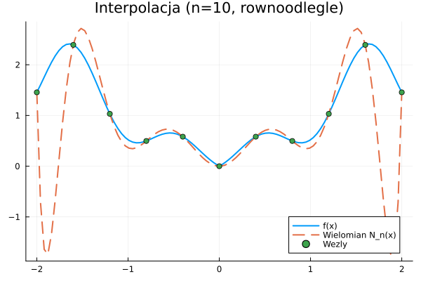
Interpolacja na węzłach równoodległych (n=10)

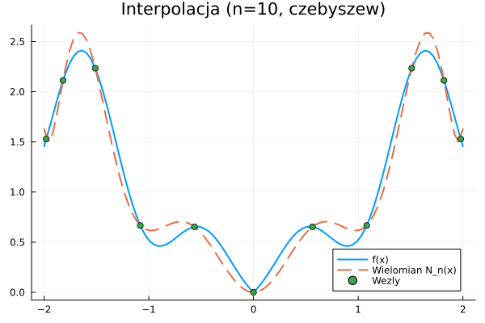
Interpolacja na węzłach Czebyszewa (n=10)

## Wnioski
- Algorymy zostaly porpawnie zaimpletowane 
- Na wykresach widać, że przy zastosowaniu węzłów równoodległych pojawiają się wyraźne błędy (oscylacje) na krańcach przedziału. Zastosowanie węzłów Czebyszewa znacząco poprawia wynik. Wynika to z faktu, że węzły te są zagęszczone na brzegach przedziału, co pozwala wielomianowi lepiej dopasować się do funkcji w tych newralgicznych miejscach i eliminuje duże odchylenia.

# 3. Zadanie 5: Zbieżność dla funkcji gładkich

Zbadano zachowanie interpolacji na węzłach równoodległych dla funkcji klasy C nieskończoność (gładkich). Sprawdzono, czy błąd maleje wraz ze wzrostem stopnia n = 5, 10, 15.

## Przypadek A: f(x) = e^x na [0, 1]

n = 5:
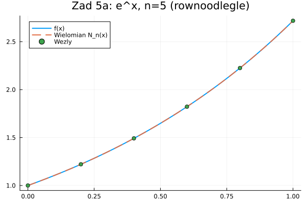

n = 10:
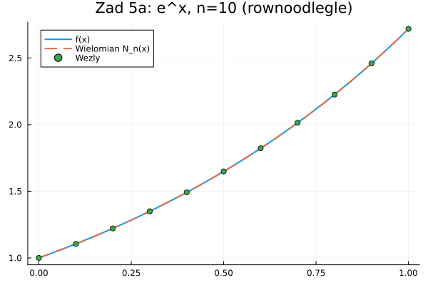

n = 15:
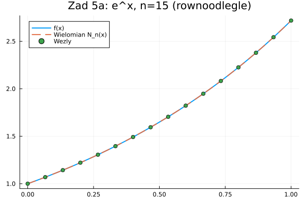

### Obserwacje
Funkcja e^x jest bardzo regularna. Już dla n=5 przybliżenie jest dobre. Wraz ze wzrostem n (Rys. 4 i 5), wielomian interpolacyjny idealnie pokrywa się z funkcją. Nie widać żadnych negatywnych efektów na brzegach.

## Przypadek B: f(x) = x^2 * sin(x) na [-1, 1]

n = 5:
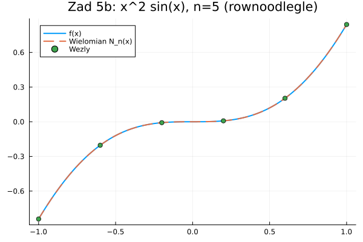

n = 10:
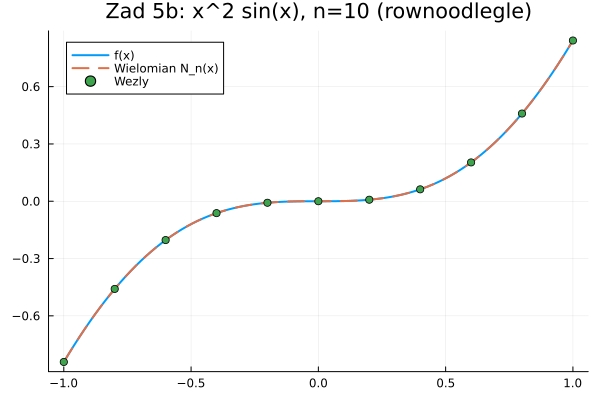

n = 15:
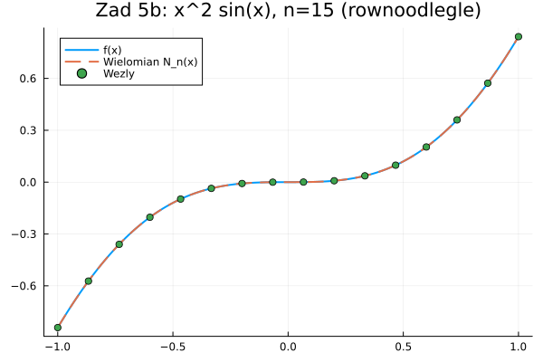

### Obserwacje
Mimo bardziej "falistego" kształtu funkcji, interpolacja na węzłach równoodległych działa poprawnie. Zwiększanie liczby węzłów (n) systematycznie zmniejsza błąd interpolacji. Dla n=15 wykresy są niemal nierozróżnialne.

### Wniosek z Zadania 5
Dla funkcji gładkich na krótkich przedziałach, interpolacja na węzłach równoodległych jest zbieżna i skuteczna.

---

# 4. Zadanie 6: Granice interpolacji (Zjawisko Rungego)

Zbadano funkcje trudne, porównując węzły równoodległe (R) i Czebyszewa (C) dla n = 5, 10, 15.

## Przypadek A: f(x) = |x| na [-1, 1] (Ostrze)

Węzły Równoodległe (n=15):
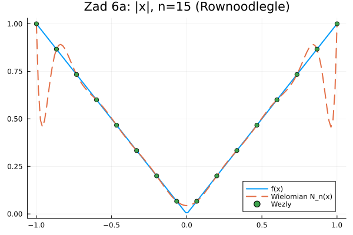

Węzły Równoodległe (n=10):
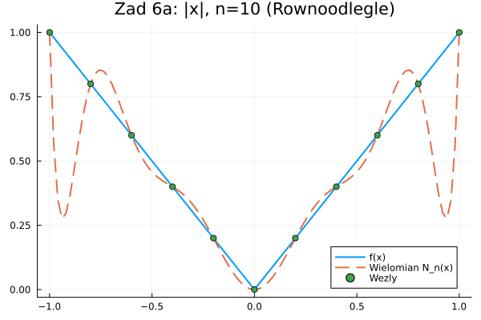

Węzły Równoodległe (n=5):
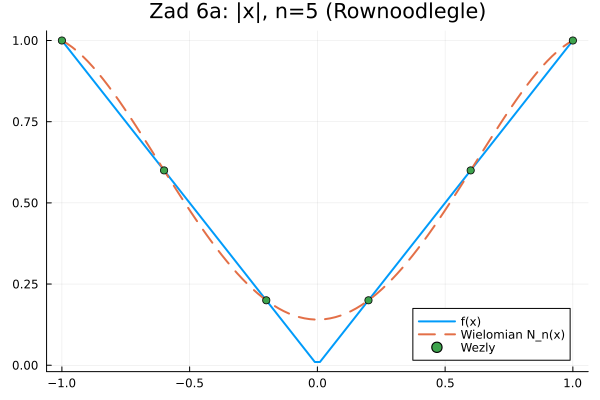

Węzły Czebyszewa (n=15):
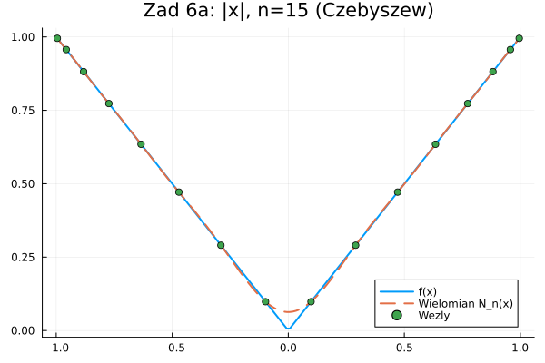

Węzły Czebyszewa (n=10):
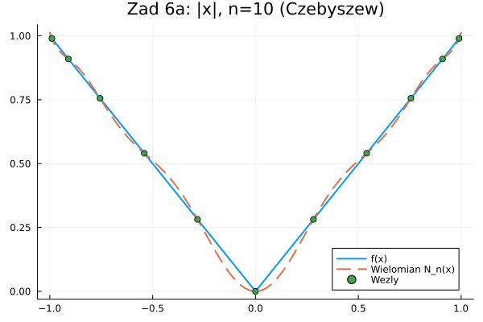

Węzły Czebyszewa (n=5):
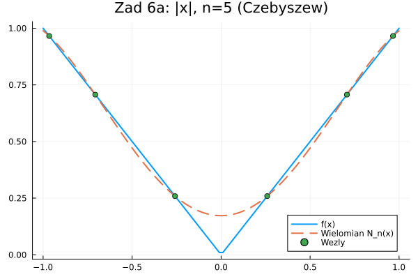

### Obserwacje
Dla węzłów równoodległych, próba odwzorowania szpica w x=0 powoduje zafalowanie wielomianu na bokach.
Dla węzłów Czebyszewa, wielomian znacznie lepiej radzi sobie z ostrzem, a błąd na reszcie przedziału jest minimalny.

## Przypadek B: f(x) = 1 / (1 + x^2) na [-5, 5] (Funkcja Rungego)

To jest kluczowy test stabilności.

### Ewolucja błędu dla węzłów Równoodległych

n=5 (Jeszcze stabilnie):
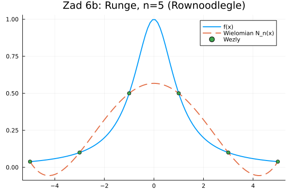

n=10 (Pojawiają się oscylacje):
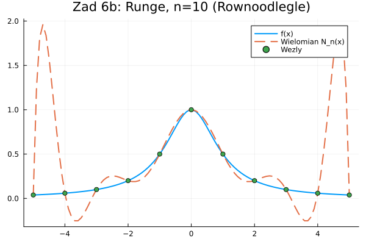

n=15 (Rozbieżność - Zjawisko Rungego):
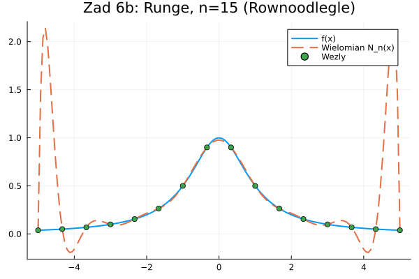

### Rozwiązanie problemu - Węzły Czebyszewa (n=15)
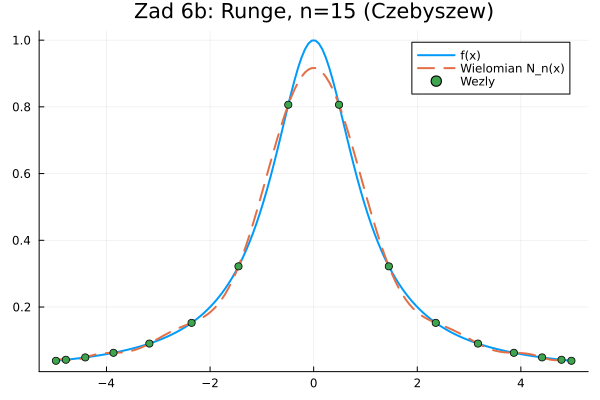

### Jak wyglada dla n=10 i n=5
n=10:
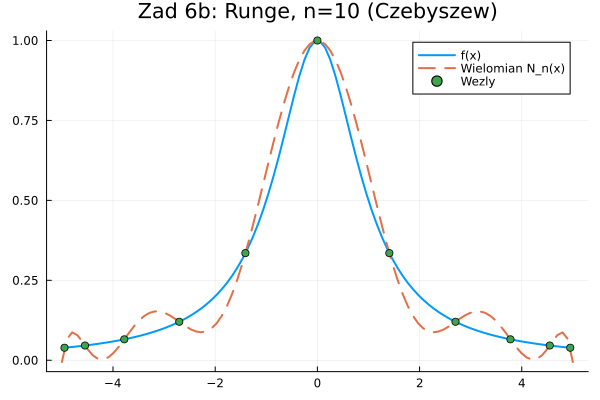
n=5:
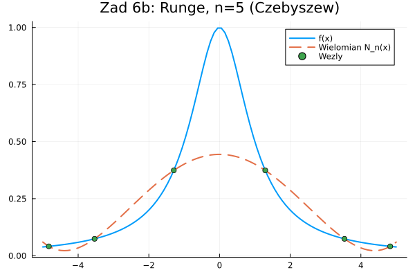 

### Analiza
To klasyczny przykład testujący stabilność interpolacji.
- Węzły równoodległe: Obserwujemy klasyczne Zjawisko Rungego. Dla n=10 i n=15 wielomian wpada w silne oscylacje na krańcach przedziału, osiągając wartości wielokrotnie przekraczające zakres funkcji. 
  Interpolacja jest rozbieżna, co wynika z niekorzystnego układu węzłów powodującego gwałtowny wzrost czynnika iloczynowego (x-x_i) we wzorze na błąd.
- Węzły Czebyszewa: Interpolacja jest zbieżna. Zastosowanie węzłów będących zerami wielomianu Czebyszewa zagęszcza punkty pomiarowe na krańcach przedziału. 
  Zgodnie z teorią, minimalizuje to normę czynnika wielomianowego w oszacowaniu błędu, co skutecznie eliminuje oscylacje Rungego. Wielomian dla n=15 niemal idealnie pokrywa się z zadaną funkcją.

### Wnioski końcowe
Wybór rodzaju węzłów ma kluczowe znaczenie dla zbieżności interpolacji wielomianowej.
1. Dla funkcji analitycznych (jak w przypadku Rungego), węzły równoodległe mogą prowadzić do rozbieżności (dużych oscylacji na brzegach) wraz ze wzrostem stopnia wielomianu.
2. Węzły Czebyszewa są rozwiązaniem optymalnym – poprzez zagęszczenie na krańcach minimalizują błąd maksymalny i gwarantują zbieżność jednostajną, eliminując zjawisko Rungego.

https://gemini.google.com/share/90be4dc69020